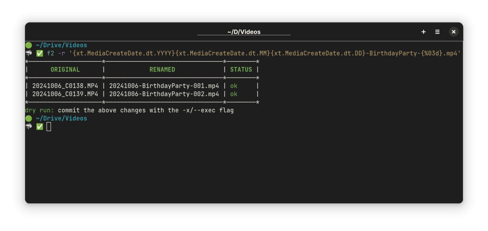

# What is F2?

F2 is a versatile tool for bulk renaming files and directories in Linux, macOS,
and Windows. It simplifies the renaming process by offering powerful workflows
while prioritizing safety to prevent data loss (such as overwriting files by
accident).

Additionally, F2 allows you to undo any operation, ensuring mistakes can be
easily corrected.

## What does F2 do differently?

Compared to other renaming tools, F2 offers several key advantages:

- **Dry Run by Default**: F2 automatically performs a dry run, showing you the
  changes in an easy-to-understand format before proceeding, so you can review
  and confirm the actions.

- **Safety First**: F2 prioritizes accuracy by ensuring every renaming operation
  is conflict-free and error-proof.

- **Conflict Resolution**: It validates each renaming operation before execution
  and provides an easy way to automatically resolve any conflicts detected.

- **Variable Support**: F2 allows you to use file attributes, such as EXIF data
  for images and ID3 tags for audio files, to give you greater flexibility in
  renaming.

- **Comprehensive Options**: Whether it's simple string replacements or complex
  regular expression operations, F2 provides a full range of renaming
  capabilities.

- **High Performance**: F2 is extremely fast and efficient, even when renaming
  thousands of files at once.

- **Undo Functionality**: Any renaming operation can be easily undone, giving
  you peace of mind in case of mistakes.

- **Extensive Documentation**: F2 is well-documented with clear, practical
  examples to help you make the most of its features without confusion.

## A Tour of F2

