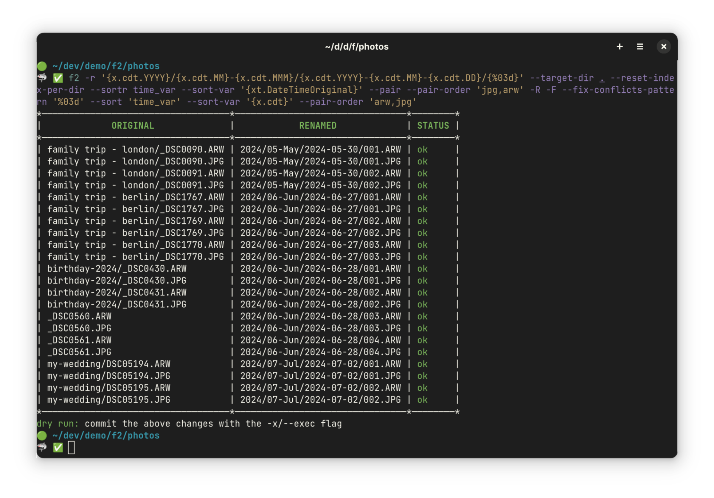

# What is F2?

F2 is a cross-platform tool for bulk renaming files and directories on Linux,
macOS, and Windows. It simplifies the renaming process by offering powerful
workflows while prioritizing safety to prevent data loss (such as overwriting
files by accident).

## What does F2 do differently?

Compared to other renaming tools, F2 offers several key advantages:

- **Dry Run by Default**: It defaults to a dry run so that you can review the
  renaming changes before proceeding.

- **Variable Support**: F2 allows you to use file attributes, such as EXIF data
  for images or ID3 tags for audio files, to give you maximum flexibility in
  renaming.

- **Comprehensive Options**: Whether it's simple string replacements or complex
  regular expressions, F2 provides a full range of renaming capabilities.

- **Safety First**: It prioritizes accuracy by ensuring every renaming operation
  is conflict-free and error-proof through rigorous checks.

- **Conflict Resolution**: Each renaming operation is validated before execution
  and detected conflicts can be automatically resolved.

- **High Performance**: F2 is extremely fast and efficient, even when renaming
  thousands of files at once.

- **Undo Functionality**: Any renaming operation can be easily undone to allow
  the easy correction of mistakes.

- **Extensive Documentation**: F2 is well-documented with clear, practical
  examples to help you make the most of its features without confusion.

## A Tour of F2

